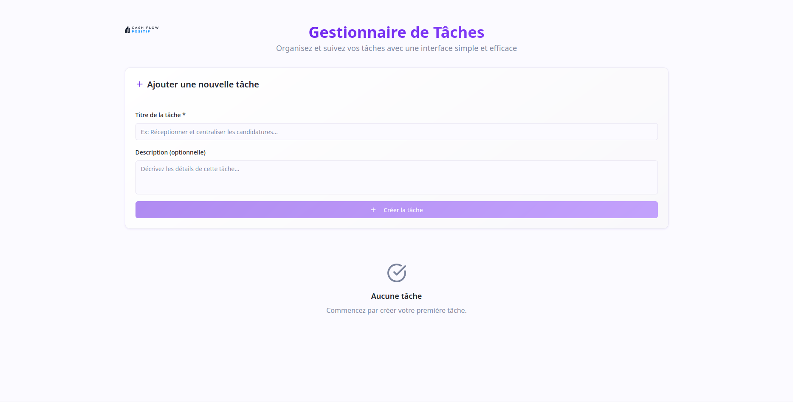
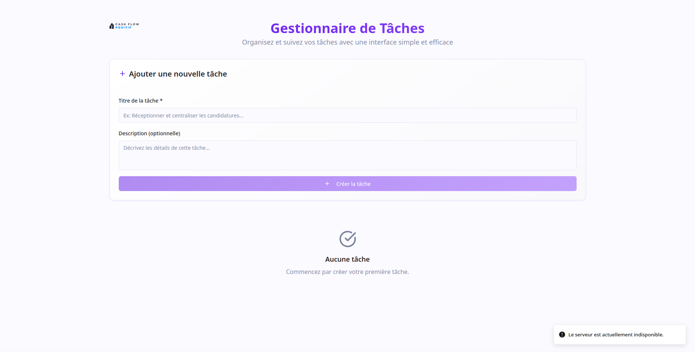
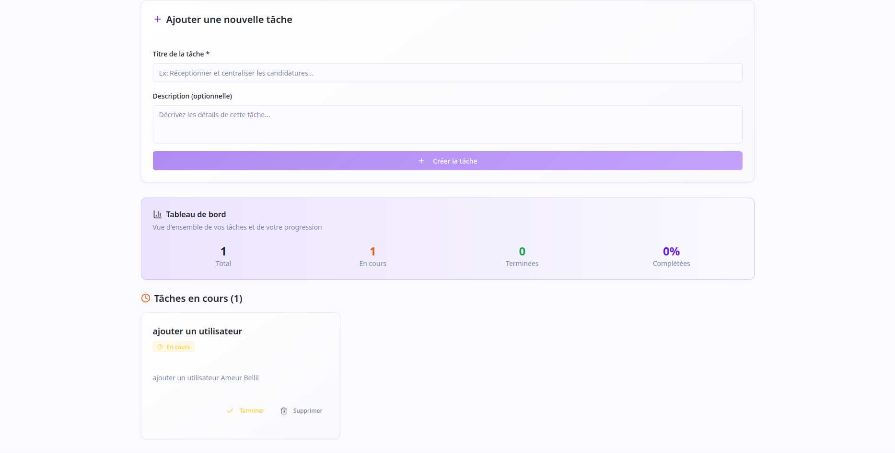
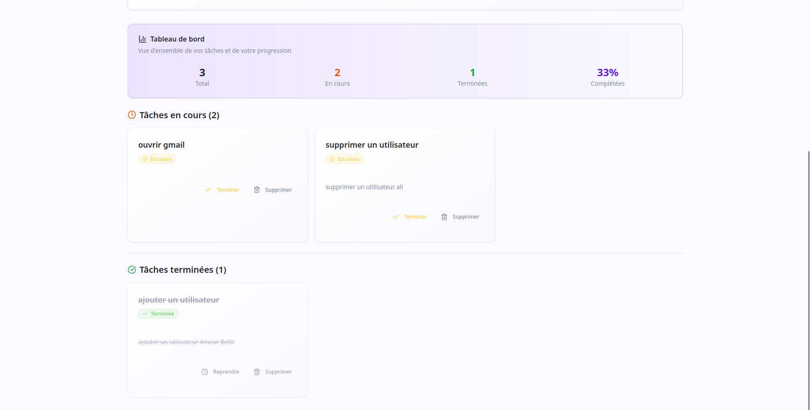

# 📋     Application de gestion des taches (React + TypeScript)

## 🧠 Objectif

Développer une application de gestion de tâches simple, destinée à une équipe interne.  
Elle permet d'ajouter, consulter, supprimer et (optionnellement) mettre à jour le statut des tâches.

---

## 🚀 Fonctionnalités

- ✅ Ajouter une tâche avec un titre et une description
- ✅ Lister toutes les tâches existantes
- ✅ Supprimer une tâche
- ✅ Mettre à jour le statut d'une tâche (`pending` → `done`)
- ✅ Détection de panne serveur via un `CustomEvent`
- ✅ Affichage d’un message d’erreur si le serveur ne répond pas
- ✅ Interface responsive et moderne (ShadCN + TailwindCSS)

---

## 📁 Structure du projet

task-manager/


├── task-manager-frontend/ # Frontend React + TypeScript


└── task-manager-backend/ # Backend Express + TypeScript

---

## ⚙️ Stack technique utilisée

### Backend :
- TypeScript
- Express
- Zod (validation)

### Frontend :
- React + TypeScript
- Tailwind CSS
- React Hook Form
- Zod
- Radix UI
- Shadcn/ui
---

## 🚀 Lancer le projet

### 1. Cloner le dépôt

```bash
# Cloner le repo
git clone https://github.com/Ameur-bellil/application-gestion-taches.git

# Aller dans le dossier
cd application-gestion-taches.

```

### 2. Lancer le Frontend

```bash
# Aller dans le dossier du frontend
cd task-manager-frontend

# Installer les dépendances
npm install

# Lancer l'application (http://localhost.localdomain:3000)
npm start

```

### 3. Lancer le backend

```bash
# Aller dans le dossier du backend
cd task-manager-backend/

# Installer les dépendances
npm install

# Lancer l'application (Server is running at http://localhost:3030 🚀🚀)
npm run dev

```

## 🖥️ Aperçu de l'application

Voici quelques captures d’écran de l’interface utilisateur :

### 📌 Page d'accueil


### ⚠️ Erreur de connexion (si le backend est indisponible)


### ➕ Ajout d'une tâche


### ✅ Tâche terminée (Done)



## 🔌 Backend attendu

L'API doit répondre sur [http://localhost:3030/tasks](http://localhost:3030/tasks) avec les routes suivantes :

| Méthode | URL             | Description                           |
|---------|------------------|---------------------------------------|
| GET     | `/tasks`         | Récupérer toutes les tâches           |
| POST    | `/tasks`         | Créer une nouvelle tâche              |
| DELETE  | `/tasks/:id`     | Supprimer une tâche                   |
| PATCH   | `/tasks/:id`     | Mettre à jour le statut (`done`)      |


## ✍️ Auteur

- 👤 **Ameur Bellil**
- 🐙 [GitHub - Ameur-bellil](https://github.com/Ameur-bellil)


